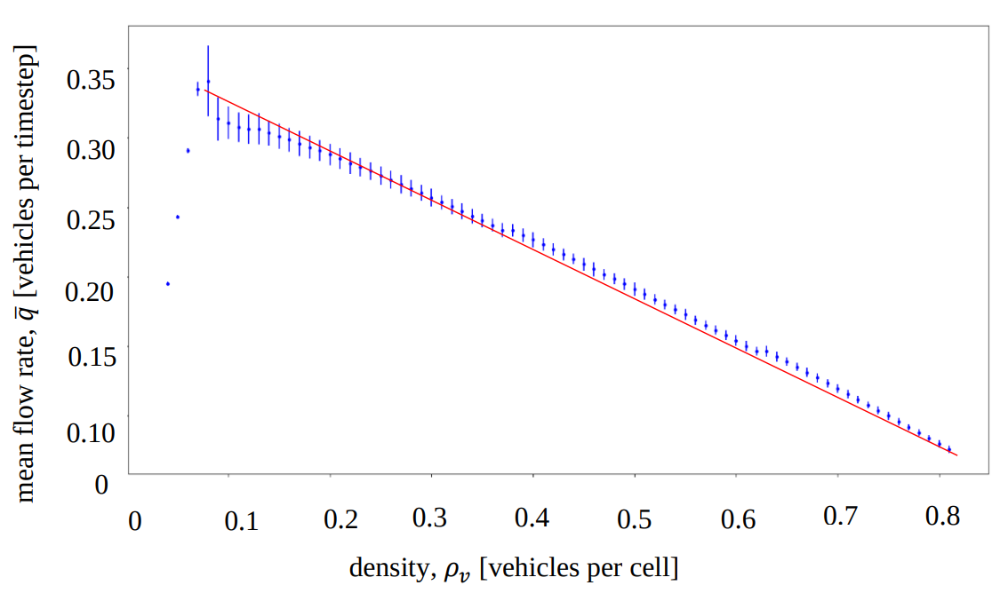

# Simulation of Traffic Flow

A cellular automaton model was constructed to model realistic traffic flow which contains characteristic features of 
non-deterministic traffic behaviour, such as non-linear backward motion of congestion and the bottlenecking of traffic 
flow. Bottleneck situations were further analysed by the implementation of traffic lights, which were regulated by 
introducing a concept called phase. Our model simulation produced fundamental diagrams of traffic flow which were 
consistent with real data results. 

The model implemented elements from a macroscopic and microscopic description of highway traffic containing a single 
lane. This aimed to understand the effects of various model parameters, such as the number of traffic lights and 
vehicular density, on traffic flow. For example, an exponential relationship between the number of traffic lights and 
the mean flow rate was demonstrated. Chaotic behaviour was generally observed for all simulations which essentially
exhibited the non-deterministic nature of realistic traffic flow. This resulted in a substantial amplification to the 
variation of flow in the critical density region which was identified by the large standard deviations.

The image below illustrates a traffic simulation with traffic lights implemented.

From these simulations, the fundamental relation of traffic flow can be represented graphically: 

This contains characteristic features consistent with a real-life example:

Other flow relations, such as the number of traffic lights, traffic light phase, etc., were analysed and graphed in the 
report found within this repository.